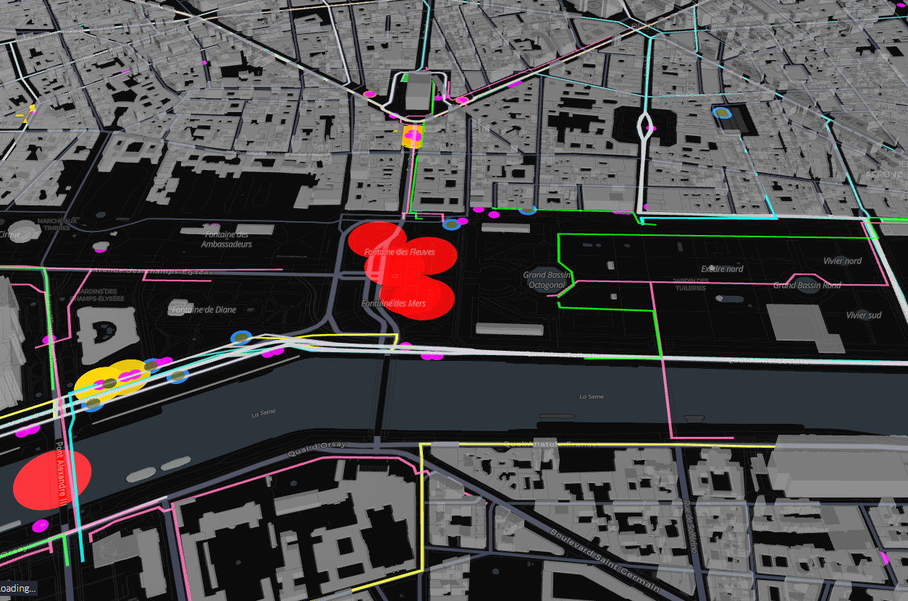
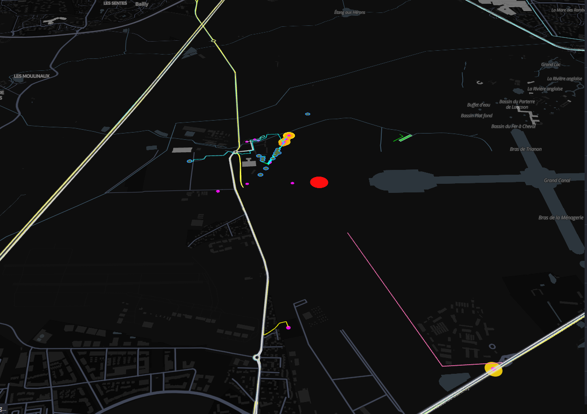

# Stratégie de valorisation des données
Les Jeux Olympiques de Paris 2024 ont marqué un tournant dans l’organisation d’événements de grande ampleur, avec **87 % des visiteurs utilisant les transports en commun** et une réduction de **54 % des émissions de carbone par rapport aux précédents JO**, tout en sachant que **les déplacements représentent 53 % des émissions de carbone des JO Paris 2024**. Notre carte interactive, qui analyse cette mobilité optimisée, n’est pas seulement un retour d’expérience : c’est un **modèle reproductible** pour tout événement futur, qu’il s’agisse d’un festival, d’un sommet international ou même d’une compétition locale.
Pour analyser l’efficacité des infrastructures de transport mises en place lors des Jeux Olympiques de Paris 2024, nous avons choisi de nous concentrer sur **trois lieux emblématiques** : Versailles, le Champ de Mars et la Place de la Concorde. Ces sites, situés à Paris et dans ses environs, ont posé des défis spécifiques en termes de gestion des flux de spectateurs et de mobilité durable.

L’organisation de la Place de la Concorde pendant les JO 2024 repose sur une gestion optimisée des flux grâce à des itinéraires distincts pour les spectateurs, accrédités et VIP. Des zones spécifiques sont dédiées aux déposes rapides et aux parkings, incluant les **parkings accrédités** ( vert militaire), les parkings relais et les espaces pour vélos. Transport hybride est privilégié avec des itinéraires piétons balisés, des navettes ultra-rapides pour les VIP et un réseau dédié aux athlètes et fédérations. La séparation claire des accès permet de fluidifier les déplacements et d’éviter les encombrements autour des sites de compétition, garantissant ainsi une circulation efficace.

L’organisation du site de **Versailles** pendant les JO 2024 repose sur une répartition plus étendue des infrastructures, nécessitant des solutions de transport multimodal et des liaisons longues distances. Les flux piétons et les itinéraires spectateurs sont plus dispersés, avec des **zones de dépose et des parkings relais éloignés**, impliquant l’usage de navettes et de liaisons rapides pour acheminer les visiteurs. Contrairement à la **Place de la Concorde**, qui devait gérer une forte densité de circulation en plein Paris, Versailles mise sur une logistique optimisée des déplacements pour relier efficacement le site aux autres infrastructures. Là où la Concorde bénéficiait d’un accès immédiat aux transports urbains, Versailles dépend davantage des **parkings relais, des navettes VIP et des liaisons intersites** pour fluidifier l’arrivée des spectateurs et accrédités.

Le **Champ de Mars**, en tant que site emblématique des JO 2024, a nécessité une organisation adaptée à son emplacement central et sa forte affluence attendue. La carte met en évidence une **forte concentration de flux piétons**, avec plusieurs itinéraires spectateurs (rose) bien définis pour réguler la circulation et éviter les points de congestion. Contrairement à Versailles, qui repose sur un réseau de transport longue distance, le Champ de Mars bénéficie d’une **connectivité immédiate aux infrastructures urbaines**, facilitant l'accès via les transports en commun. Des **zones de dépose-reprise (or et magenta)** sont stratégiquement placées aux abords du site, tandis que les **parkings accrédités (vert militaire)** et relais sont limités, privilégiant les transports publics. Les **lignes de transport rapide (violet et jaune néon)** montrent une optimisation pour le déplacement des athlètes et VIP, soulignant la nécessité de fluidifier les flux dans un espace restreint. En comparaison avec la Place de la Concorde, où les voies d'accès sont plus compartimentées, le Champ de Mars semble offrir une **meilleure dispersion des flux**, bien que le défi majeur reste la gestion des foules aux abords de la Tour Eiffel.

Ce travail a permis de démontrer l'importance d'une gestion optimisée des infrastructures de transport lors d'événements de grande ampleur, comme les Jeux Olympiques et Paralympiques de Paris 2024. En analysant les données collectées sur les parkings relais, les flux piétons, les itinéraires de spectateurs et autres infrastructures de mobilité, nous avons pu mettre en évidence la pertinence de solutions multimodales et de stratégies de déploiement efficaces pour garantir la fluidité des déplacements tout en minimisant l'impact environnemental. La carte interactive et l'analyse des données offrent ainsi une vision claire et précise de l'efficacité du système de transport mis en place, servant de modèle pour de futurs événements d'envergure. 

